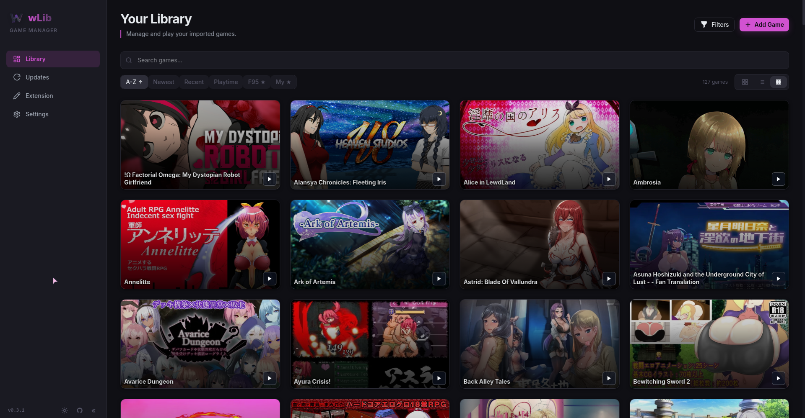
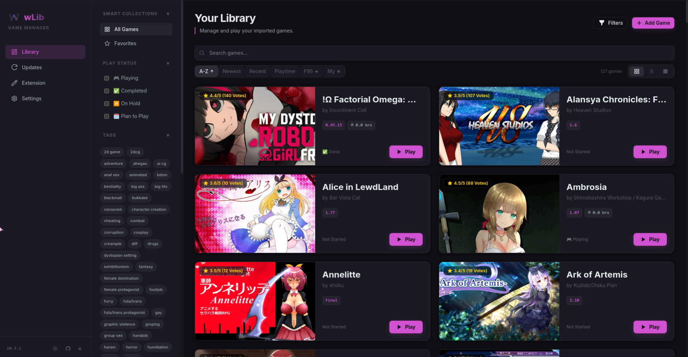
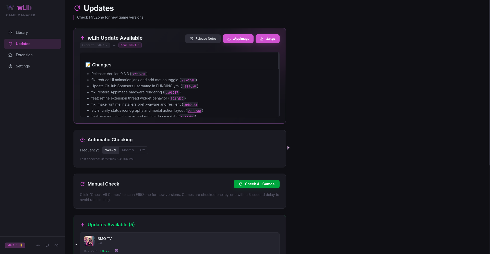
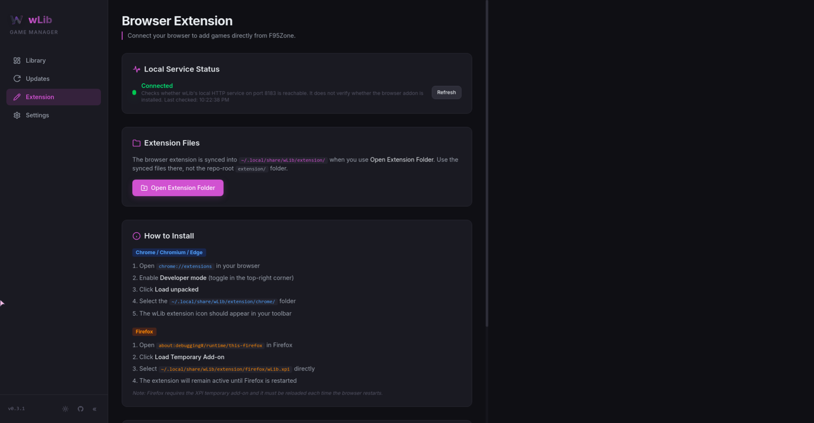
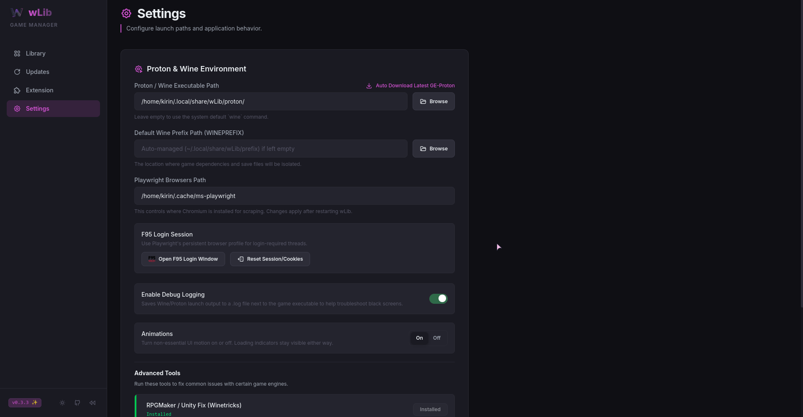
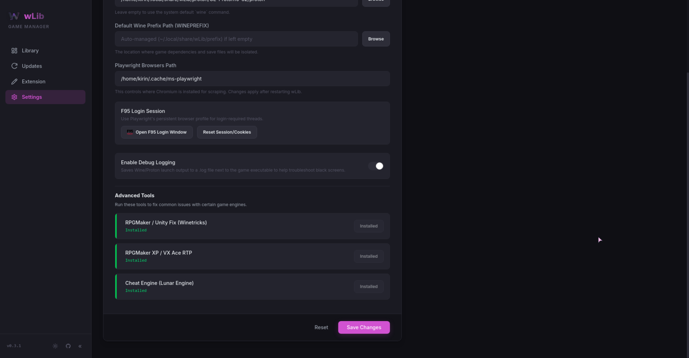

<p align="center">
  
</p>

<h1 align="center">wLib</h1>

<p align="center">
  <b>A modern Linux game manager for F95Zone</b>
</p>

<p align="center">
  <a href="LICENSE"></a>
  
  
  
</p>

---

wLib is a native Linux desktop application for managing, launching, and updating your F95Zone game library. It wraps a beautiful Vue 3 frontend inside a PyWebView shell, launches games through Wine or Proton, and tracks updates seamlessly by scraping F95Zone thread pages.

## 🐧 Why wLib?

wLib was inspired by tools like **xLibrary** and other Windows-centric game managers. However, wLib is built from the ground up to be:

| | |
|:--|:--|
| 🔓 **100% Open-Source** | Every component — backend, frontend, and extension — is fully open-source and auditable. |
| 🐧 **Native to Linux** | No Electron, no heavy frameworks. Just Python + Vue in a lightweight, native webview shell. |
| 🍷 **First-class Wine & Proton** | Built-in support for Wine, Proton-GE, and native Linux runtimes out of the box. |

If you've been looking for a game manager that truly belongs on Linux, wLib is for you.

## ✨ Features

### 🎮 Library & Organization
- **Smart Game Library** — Add, organize, rate, and track your games with cover art, tags, and progress status.
- **Playtime Tracking** — Automatically monitors game processes to calculate precisely how long you've played.
- **Dark & Light Themes** — Toggle instantly between a polished dark mode and a clean light interface.

### 🚀 Advanced Launcher
- **Universal Engine Support** — Seamlessly launch and manage games built on Ren'Py, Unity, Unreal Engine, Godot, RPG Maker (MV/MZ/VX/XP), Wolf RPG Editor, and native Linux engines.
- **Wine / Proton Integration** — Support for Wine, Proton, native Linux binaries, shell scripts, and even `.jar` files safely.
- **Engine Auto-Configuration** — Automatically applies environment tweaks (like `winegstreamer=d` for RPGMaker/NW.js) to fix common black screens.
- **Japanese Locale Mode** — Run games strictly with `LC_ALL=ja_JP.UTF-8` locale for parsing untranslated Japanese titles correctly.
- **Wayland Support** — Force `SDL_VIDEODRIVER=wayland` with a single toggle.
- **Cheat Engine Injection** — Auto-downloads and seamlessly injects Lunar Engine (a Cheat Engine fork) securely into running Windows games.
- **Dependency Installers** — One-click Wine installers for common visual novel and RPG runtime dependencies (DirectX, VCRedist, fonts) and RTPs.

### 🌐 F95Zone Integration & Automation
- **Automated Update Checker** — Tracks your local version against the latest releases by scraping F95Zone threads.
- **Cloudflare Bypass** — Intelligently resolves Cloudflare Anti-Bot challenges using Microsoft Playwright to ensure scraping remains reliable.
- **Browser Extension** — A custom Chrome/Firefox extension that injects "Add to wLib" and "Open in wLib" buttons directly onto F95Zone pages.

> [!TIP]
> wLib includes an **In-App Updater** for its own releases, meaning you can download the latest AppImage and view changelogs directly from the settings page!

## 📸 Screenshots

<table>
  <tr>
    <td align="center"><b>Library View (Small Grid)</b></td>
    <td align="center"><b>Library View (Grid)</b></td>
  </tr>
  <tr>
    <td></td>
    <td></td>
  </tr>
  <tr>
    <td align="center"><b>Update Tracker</b></td>
    <td align="center"><b>Browser Extension</b></td>
  </tr>
  <tr>
    <td></td>
    <td></td>
  </tr>
  <tr>
    <td align="center"><b>App Settings</b></td>
    <td align="center"><b>Game Configurations</b></td>
  </tr>
  <tr>
    <td></td>
    <td></td>
  </tr>
</table>

## 📋 Requirements

### System Dependencies

| Dependency | Required | Purpose |
|------------|----------|---------|
| **Python 3.12+** | ✅ | Backend runtime |
| **Node.js 18+** | ⚙️ Build only | Compiles the Vue frontend |
| **Wine** | ✅ | Runs Windows game executables |
| **Winetricks** | ✅ | Installs Windows DLLs and runtime libraries |
| **GTK 3 / PyGObject** | ✅ | Native UI integration (file dialogs, system tray) |

> [!NOTE]
> The `wlib.sh` launcher script automatically creates a Python virtual environment and installs all missing **pip** dependencies for you. You only need to ensure the system-level packages listed above are installed.

### Install System Packages

<details>
<summary><b>Ubuntu / Debian</b></summary>

```bash
sudo apt update
sudo apt install python3 python3-venv python3-gi python3-gi-cairo \
                 gir1.2-gtk-3.0 wine winetricks nodejs npm
```
</details>

<details>
<summary><b>Fedora / RHEL</b></summary>

```bash
sudo dnf install python3 python3-gobject gtk3 wine winetricks nodejs npm
```
</details>

<details>
<summary><b>Arch / Manjaro</b></summary>

```bash
sudo pacman -S python python-gobject gtk3 wine winetricks nodejs npm
```
</details>

## 🚀 Installation

### Option 1: AppImage (Recommended)

Download the latest `.AppImage` from the [Releases](https://github.com/kirin-3/wLib/releases) page:

```bash
chmod +x wLib-*.AppImage
./wLib-*.AppImage
```

> [!IMPORTANT]
> Some AppImages require FUSE to run. If your distribution doesn't have it enabled by default (like Ubuntu 22.04+), install `libfuse2`.

### Option 2: tar.gz Archive

```bash
tar xzf wLib-*-linux-x86_64.tar.gz
cd wLib-*/
./wlib.sh
```

### Option 3: Run from Source

```bash
git clone https://github.com/kirin-3/wLib.git
cd wLib

# Build the Vue frontend
cd ui && npm install && npm run build && cd ..

# Launch (auto-creates venv and installs Python deps)
./wlib.sh
```

## 🛠️ Development

### Dev Mode with Hot Reload

For active development, wLib supports a Vite dev server with hot module replacement:

```bash
# Terminal 1: Start the Vite dev server
cd ui
npm install
npm run dev

# Terminal 2: Launch wLib in dev mode
DEV_MODE=1 python main.py
```

This connects PyWebView natively to `http://localhost:5173` so you receive instant frontend updates without a separate rebuild step.

> [!NOTE]
> Read the complete architectural breakdown and module specifications in the [Developer Documentation](docs/README.md).

## 🌐 Browser Extension

wLib includes a browser extension that adds quick-action buttons directly to F95Zone thread pages. These buttons communicate securely with your running wLib app over a local HTTP server on port `8183`.

The app synchronizes the browser extension files into `~/.local/share/wLib/extension/` on startup and again when you use the Extension page's **Open Extension Folder** button.

If the bundled extension version changes, wLib shows a startup toast telling you to reload the browser addon so the new files take effect.

### Chrome, Chromium, Brave, Edge

1. Open your Chromium-based browser.
2. Navigate to `chrome://extensions/`.
3. Enable **Developer mode** in the top right.
4. Click **Load unpacked** and select the newly extracted folder: `~/.local/share/wLib/extension/chrome/`.
5. Visit any F95Zone thread to see the wLib integration buttons!

### Firefox

1. Open a new tab and navigate to `about:debugging#/runtime/this-firefox`.
2. Click **Load Temporary Add-on**.
3. Select the file: `~/.local/share/wLib/extension/firefox/wLib.xpi`.

> [!WARNING]
> Do NOT load the raw `extension/` directory directly in Firefox. Firefox requires the generated `.xpi` archive natively. Note that because Firefox enforces manifest strictness, temporary add-ons must be reloaded after each browser restart.

## 🐛 Reporting Bugs

Found a bug? Please [open an issue](https://github.com/kirin-3/wLib/issues/new?template=bug_report.yml) and include:

- **Steps to reproduce** the issue
- **Expected vs actual behavior**
- Your **Linux distribution**, version, and display server (X11/Wayland)
- Your **Wine/Proton version** (if game-launch related)
- Any **error logs** (enable logging in Settings → Debug Logging)

## 🤝 Contributing

Contributions are highly welcome! Whether it's tracking down an RPGMaker engine quirk or refactoring Vue components, we'd love your help. 

Please read the [Contributing Guide](CONTRIBUTING.md) to initialize your dev environment properly before submitting pull requests.

## 📄 License

This project is licensed under the [MIT License](LICENSE).
