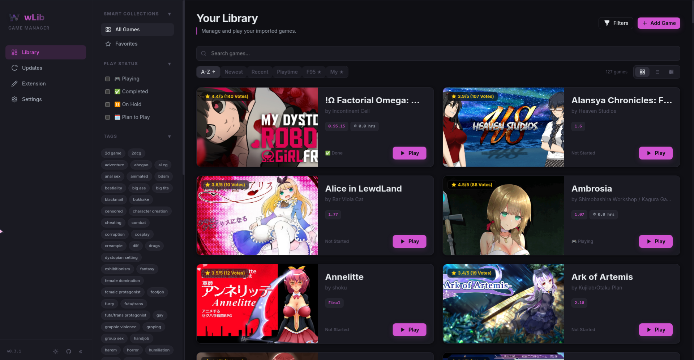
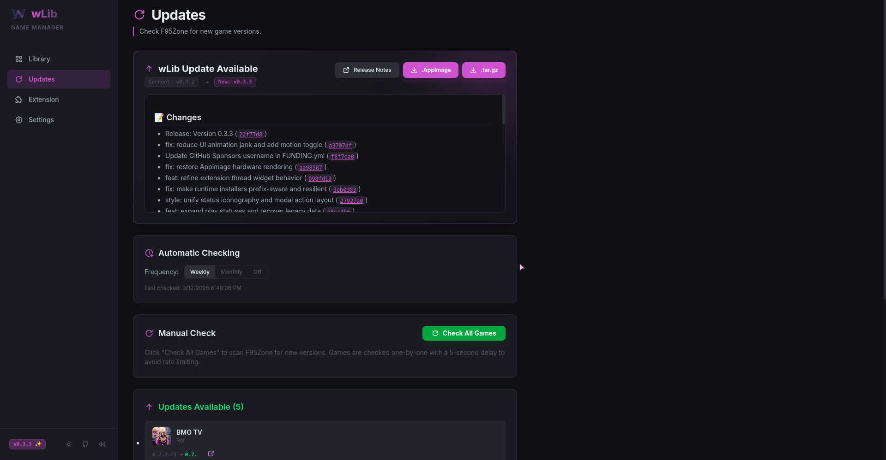
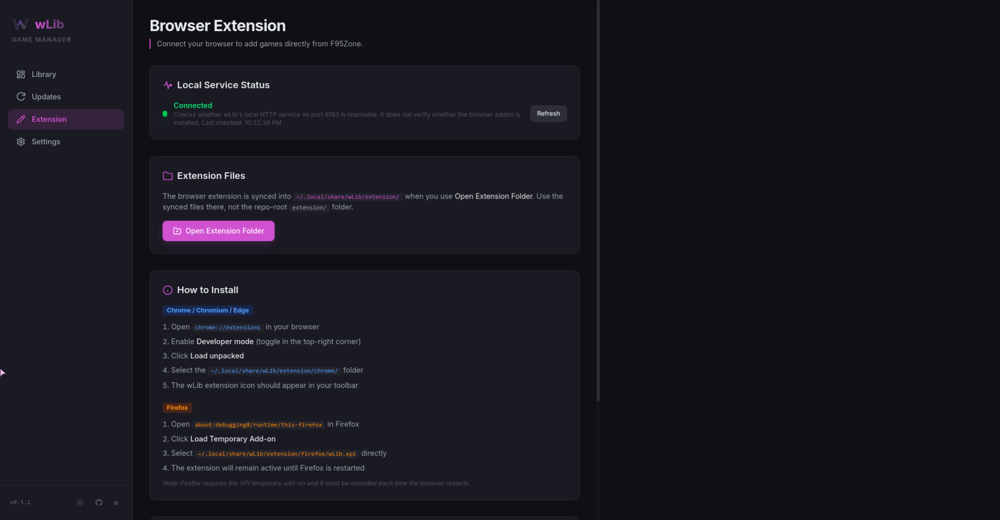
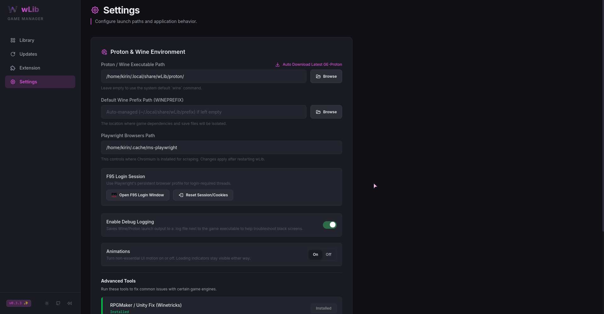
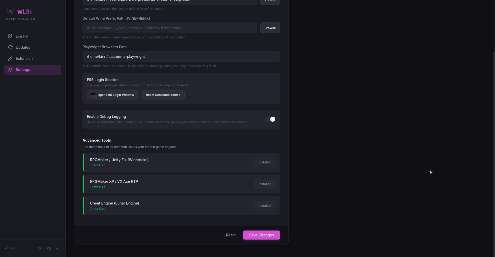

<p align="center">
  
</p>

<h1 align="center">wLib</h1>

<p align="center">
  <b>A cross-platform desktop game manager for F95Zone</b>
</p>

<p align="center">
  <a href="LICENSE"></a>
  
  
  
</p>

---

wLib is a Linux and Windows desktop application for managing, launching, and updating your F95Zone game library. It wraps a Vue 3 + TypeScript frontend inside a PyWebView shell and tracks updates by scraping F95Zone thread pages. Linux supports native, Wine, Proton, and optional RPGMaker Linux runner modes. Windows launches supported game targets directly and does not require Wine, Proton, or Winetricks.

## Platform behavior

On Windows, Auto Detect launches `.exe` files directly, `.bat`/`.cmd` files through `cmd.exe`, `.jar` files through `java -jar` (Java must be on `PATH`), and `.html`/`.htm` files in the default browser. HTML games do not support playtime tracking. Wine/Proton, Winetricks/RTP installers, Wayland, the RPGMaker Linux runner, and Cheat Engine injection are Linux-only; their controls are hidden on Windows. Imported per-game launch options are preserved, but an unavailable launch mode must be changed to Auto Detect before launching on Windows.

## 🐧 Why wLib?

wLib was inspired by tools like **xLibrary** and other Windows-centric game managers. However, wLib is built from the ground up to be:

| | |
|:--|:--|
| 🔓 **100% Open-Source** | Every component — backend, frontend, and extension — is fully open-source and auditable. |
| 🖥️ **Native Desktop App** | Python + Vue in a PyWebView Qt WebEngine shell on Linux and Windows. |
| 🍷 **First-class Launching** | Native Windows launching plus Wine, Proton-GE, native Linux runtimes, and optional RPGMaker Linux runner workflows on Linux. |

The same library can move between Linux and Windows through semantic JSON import/export. Platform-specific launch settings are preserved but only offered where supported.

## ✨ Features

### 🎮 Library & Organization
- **Smart Game Library** — Add, organize, rate, and track your games with cover art, tags, and progress status.
- **Playtime Tracking** — Automatically monitors game processes to calculate precisely how long you've played.
- **Portable JSON Migration** — Export and import your library, playtime, launch options, and selected settings with one JSON file.
- **Additional Launch Targets** — Add named executables for multi-part games while keeping one canonical default launch path.
- **Dark & Light Themes** — Toggle instantly between a polished dark mode and a clean light interface.

### 🚀 Advanced Launcher
- **Universal Engine Support** — Seamlessly launch and manage games built on Ren'Py, Unity, Unreal Engine, Godot, RPG Maker (MV/MZ/VX/XP), Wolf RPG Editor, and native Linux engines.
- **Launch Modes** — Auto Detect on both platforms; Linux also offers Linux Native, Wine / Proton, and RPGMaker Linux with an external runner you install or configure.
- **Wine / Proton Integration (Linux)** — Support for Wine, Proton, native Linux binaries, and shell scripts. Both platforms can launch `.jar` files with Java installed.
- **Engine Auto-Configuration (Linux)** — Automatically applies Wine environment tweaks (like `winegstreamer=d` for RPGMaker/NW.js) to fix common black screens.
- **Japanese Locale Mode (Linux)** — Sets `LC_ALL=ja_JP.UTF-8`; this environment override is not applied to native Windows launches.
- **Wayland Support (Linux)** — Applies Wayland compatibility settings with a single toggle.
- **Cheat Engine Injection (Linux)** — Auto-downloads and injects Lunar Engine (a Cheat Engine fork) into games running through Wine/Proton.
- **Dependency Installers (Linux)** — One-click Wine installers for common visual novel and RPG runtime dependencies (DirectX, VCRedist, fonts) and RPGMaker RTPs/DLLs. On Windows, install any game-required runtimes using their native installers.

### 🌐 F95Zone Integration & Automation
- **Automated Update Checker** — Tracks your local version against the latest releases by scraping F95Zone threads.
- **Cloudflare Bypass** — Intelligently resolves Cloudflare Anti-Bot challenges using Microsoft Playwright to ensure scraping remains reliable.
- **Browser Extension** — A custom Chrome/Firefox extension that injects "Add to wLib" and "Open in wLib" buttons directly onto F95Zone pages.
- **Persistent Browser Sessions** — F95Zone login sessions are saved under `~/.local/share/wLib/browser_session` on Linux or `%LOCALAPPDATA%\wLib\browser_session` on Windows so you stay logged in across restarts.

> [!TIP]
> wLib can check for newer GitHub releases and open the latest release page directly from the Updates view.

## 📸 Screenshots

<table>
  <tr>
    <td align="center"><b>Library View (Small Grid)</b></td>
    <td align="center"><b>Library View (Grid)</b></td>
  </tr>
  <tr>
    <td></td>
    <td></td>
  </tr>
  <tr>
    <td align="center"><b>Update Tracker</b></td>
    <td align="center"><b>Browser Extension</b></td>
  </tr>
  <tr>
    <td></td>
    <td></td>
  </tr>
  <tr>
    <td align="center"><b>App Settings</b></td>
    <td align="center"><b>Game Configurations</b></td>
  </tr>
  <tr>
    <td></td>
    <td></td>
  </tr>
</table>

## 📋 Requirements

### System Dependencies

Windows x64 users can install the MSI or extract the portable ZIP without installing Python, Node, Wine, Proton, Winetricks, or GTK. Chromium is downloaded in the background on first startup if missing, into `%LOCALAPPDATA%\wLib\playwright`, so network access is needed before scraping.

| Dependency | Platform / when needed | Purpose |
|------------|------------------------|---------|
| **Python 3.12** | Linux and Windows, source/dev only | Backend development and CI toolchain |
| **Node.js 22.12+ and npm** | Linux and Windows, source/frontend builds only | Compiles the Vue frontend and runs unit tests |
| **Wine / Proton** | Linux, Windows game launches | Runs Windows game executables on Linux |
| **Winetricks** | Linux, optional runtime installers | Installs DLLs and runtime libraries into Wine prefixes |
| **GTK 3 / PyGObject** | Linux desktop integration | Optional native desktop integrations; Windows uses its native dialogs |
| **Java** | Either platform, `.jar` games only | Provides the `java` command used by the launcher |

> [!NOTE]
> Binary releases bundle Python dependencies. The source-tree `wlib.sh` launcher creates a Python virtual environment and installs missing **pip** dependencies when running from source.

### GPU & Rendering

wLib uses Qt WebEngine on both platforms. Linux release launchers include automatic GPU detection and a crash guard system for cross-distro compatibility:

- **GPU Detection**: On startup, release launchers probe your GPU using `glxinfo` and `/sys/class/drm/` to determine hardware acceleration availability
- **Crash Guard**: If the app crashes during accelerated startup, the next launch automatically falls back to software rendering via `QT_QUICK_BACKEND=software`
- **Renderer Diagnostics**: GPU detection results and Qt backend choices are logged to `~/.local/share/wLib/renderer-diagnostics.log` and the active launcher log.

Windows lets Qt select the native platform and renderer, and writes diagnostics to `%LOCALAPPDATA%\wLib\renderer-diagnostics.log`. Linux `xcb`/Wayland overrides and the shell launcher's GPU crash guard do not apply to Windows.

### Install Linux System Packages

<details>
<summary><b>Ubuntu / Debian</b></summary>

```bash
sudo apt update
sudo apt install python3 python3-venv python3-gi python3-gi-cairo \
                 gir1.2-gtk-3.0 wine winetricks nodejs npm
```
</details>

<details>
<summary><b>Fedora / RHEL</b></summary>

```bash
sudo dnf install python3 python3-gobject gtk3 wine winetricks nodejs npm
```
</details>

<details>
<summary><b>Arch / Manjaro</b></summary>

```bash
sudo pacman -S python python-gobject gtk3 wine winetricks nodejs npm
```
</details>

## 🚀 Installation

### Windows x64: MSI or Portable ZIP

Download either Windows artifact from the [Releases](https://github.com/kirin-3/wLib/releases) page:

- `wLib-<version>-windows-x64.msi` installs per-user under `%LOCALAPPDATA%\Programs\wLib`, adds a Start Menu shortcut (desktop shortcut optional), and supports upgrades, repair, and clean uninstall.
- `wLib-<version>-windows-x64-portable.zip` can be extracted anywhere and run with `wLib.exe`.

The MSI removes only installed program files and shortcuts. Library data, settings, scraper sessions, and Playwright browsers under `%LOCALAPPDATA%\wLib` remain after uninstall. The portable ZIP uses that same data directory; its library is not stored beside `wLib.exe`. SHA-256 hashes are published beside the artifacts.

Windows builds are currently unsigned, so Windows SmartScreen shows "Windows protected your PC" on first launch. Click **More info → Run anyway**. If you downloaded the portable ZIP, you can instead right-click it before extracting, open **Properties**, and tick **Unblock**. Verify the download against the published SHA-256 hashes if you want to be sure it is the official build.

### Linux Option 1: AppImage

Download the latest `.AppImage` from the [Releases](https://github.com/kirin-3/wLib/releases) page:

```bash
chmod +x wLib-*.AppImage
./wLib-*.AppImage
```

> [!IMPORTANT]
> Some AppImages require FUSE to run. If your distribution doesn't have it enabled by default (like Ubuntu 22.04+), install `libfuse2`.

### Linux Option 2: Native Packages

Download the latest `.deb` or `.rpm` from the [Releases](https://github.com/kirin-3/wLib/releases) page:

```bash
# Debian / Ubuntu / Mint
sudo apt install ./wLib-*-linux-x86_64.deb

# Fedora / RPM-family
sudo dnf install ./wLib-*-linux-x86_64.rpm
```

Native packages install wLib under `/opt/wlib` and expose the `wlib` command through `/usr/bin/wlib`.

### Linux Option 3: AUR

Arch users can install the binary release package as `wlib-bin` after the generated AUR metadata is published:

```bash
paru -S wlib-bin
```

### Linux Option 4: tar.gz Archive

```bash
tar xzf wLib-*-linux-x86_64.tar.gz
cd wLib-*/
./wlib
```

### Run from Source on Linux

```bash
git clone https://github.com/kirin-3/wLib.git
cd wLib

# Build the Vue frontend
cd ui && npm install && npm run typecheck && npm run build && cd ..

# Launch (auto-creates venv and installs Python deps)
./wlib.sh
```

### Run from Source on Windows (PowerShell)

Install Python 3.12, Git, and Node.js 22.12+ with npm, then run:

```powershell
git clone https://github.com/kirin-3/wLib.git
Set-Location wLib
py -3.12 -m venv .venv
.\.venv\Scripts\python.exe -m pip install -r requirements-windows.txt

Set-Location ui
npm ci
npm run typecheck
npm run build
Set-Location ..

.\.venv\Scripts\python.exe main.py
```

Build Windows release artifacts with `scripts\build-windows.ps1`; see [Build & Packaging](docs/build.md). For contributor dependencies and checks, see [CONTRIBUTING.md](CONTRIBUTING.md).

## 🛠️ Development

### Dev Mode with Hot Reload

For active development on Linux, wLib supports a Vite dev server with hot module replacement:

```bash
# Terminal 1: Start the Vite dev server
cd ui
npm install
npm run dev

# Terminal 2: Launch wLib in dev mode
DEV_MODE=1 python main.py
```

This connects PyWebView natively to `http://localhost:5173` so you receive instant frontend updates without a separate rebuild step.

On Windows, `npm run dev` works for browser-only frontend development with mock API responses. Desktop `DEV_MODE` currently invokes `npm` directly and can fail with `WinError 2` when Node provides only `npm.cmd`; use the source-run steps above to rebuild `ui/dist/` and test the real desktop bridge. See the [contributing guide](CONTRIBUTING.md#running-the-app-locally) for platform-specific commands.

Before submitting frontend changes, run:

```bash
cd ui
npm run typecheck
npm run build
```

### Quick Backend Verification

Use the smoke backend test to verify your environment without opening the UI. On Windows, first set `WLIB_DATA_DIR` to a temporary directory; changing `HOME` alone does not isolate `%LOCALAPPDATA%`. The [contributing guide](CONTRIBUTING.md#smoke-backend-test) includes a PowerShell example that restores the environment afterward.

```bash
python scripts/smoke_backend.py
```

This runs extension sync and Qt/Playwright initialization with temporary HOME and browser paths.

> [!NOTE]
> Read the complete architectural breakdown and module specifications in the [Developer Documentation](docs/README.md).

## 🌐 Browser Extension

wLib includes a browser extension that adds quick-action buttons directly to F95Zone thread pages. These buttons communicate securely with your running wLib app over a local HTTP server on port `8183`.

The app synchronizes browser extension files into `~/.local/share/wLib/extension/` on Linux or `%LOCALAPPDATA%\wLib\extension` on Windows, and exposes the resolved folder through **Open Extension Folder**.

If the bundled extension version changes, wLib shows a startup toast telling you to reload the browser addon so the new files take effect.

### Chrome, Chromium, Brave, Edge

1. Open your Chromium-based browser.
2. Navigate to `chrome://extensions/`.
3. Enable **Developer mode** in the top right.
4. Click **Load unpacked** and select `chrome/` inside the folder shown by **Open Extension Folder**: `~/.local/share/wLib/extension/chrome/` on Linux or `%LOCALAPPDATA%\wLib\extension\chrome` on Windows.
5. Visit any F95Zone thread to see the wLib integration buttons!

### Firefox

1. Open Firefox **Add-ons and themes**.
2. Click the gear icon and choose **Install Add-on From File...**.
3. Select `firefox/wLib.xpi` inside the folder shown by **Open Extension Folder**: `~/.local/share/wLib/extension/firefox/wLib.xpi` on Linux or `%LOCALAPPDATA%\wLib\extension\firefox\wLib.xpi` on Windows.
4. Confirm the installation when Firefox prompts you.

> [!WARNING]
> Do NOT load the raw `extension/` directory directly in Firefox. Release builds include a signed `.xpi` for normal Firefox installation; local development builds may generate an unsigned fallback XPI for smoke checks.

## 🐛 Reporting Bugs

Found a bug? Please [open an issue](https://github.com/kirin-3/wLib/issues/new?template=bug_report.yml) and include:

- **Steps to reproduce** the issue
- **Expected vs actual behavior**
- Your **operating system and version**: Windows version/build or Linux distribution and display server (X11/Wayland)
- Your **installation format** (Windows MSI/portable ZIP, Linux package/AppImage, or source)
- Your **Wine/Proton version** (Linux compatibility launches only)
- Any **error logs** (enable logging in Settings → Debug Logging)

## 🤝 Contributing

Contributions are highly welcome! Whether it's tracking down an RPGMaker engine quirk or refactoring Vue components, we'd love your help. 

Please read the [Contributing Guide](CONTRIBUTING.md) to initialize your dev environment properly before submitting pull requests.

## 📄 License

This project is licensed under the [GNU General Public License v3.0 or later](LICENSE).
