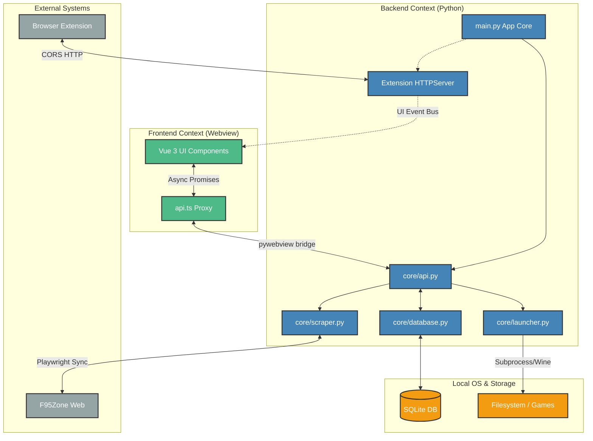

# Architecture Overview

wLib uses a hybrid desktop application architecture. It combines a modern web frontend with a powerful Python backend capable of heavy local OS operations.

## High-Level System Diagram

## Tech Stack Overview

- **Backend Environment**: Python 3
- **Desktop Window Manager**: PyWebView (utilizing PyQt6 / Qt WebEngine by default on Linux)
- **Frontend Framework**: Vue 3 (Composition API) + TypeScript + Vite + TailwindCSS
- **Database**: SQLite3 (Local file-based database)
- **Web Automation**: Microsoft Playwright (Sync API for background scraping)
- **Packaging**: PyInstaller and bash scripts (built into AppImage for distribution)

## Process Isolation & Communication

wLib operates across two distinct contexts that never directly share memory:

1. **Python Backend Process (`main.py`)**:
   - Manages the entire lifecycle of the application.
   - Bootstraps the local SQLite database.
   - Ensures Microsoft Playwright's Chromium binaries are available on the user's system.
   - Starts the `http.server` daemon thread for the browser extension.
   - Instantiates the `pywebview` window and maps a Python class object (`Api`) to the JavaScript runtime.

2. **TypeScript UI Context (Vue / Vite)**:
   - Runs purely inside the WebView constraint and lacks direct Node.js or native filesystem access.
   - Interacts with Python backend purely through async calls routed strictly via `window.pywebview.api`.
   - Python can also spontaneously send data to the frontend by executing JavaScript snippets inside the webview using `webview.evaluate_js()`. This is how background events like "Playtime Updated" or "Extension Add Request" are propagated into Vue's reactivity system.

## The `DEV_MODE=1` Loop

When executing in development mode (`DEV_MODE=1`), the Python backend skips loading the static built Vue files `ui/dist/`. Instead, it forcefully navigates the Webview frame to `http://localhost:5173`, allowing Vite's Hot Module Replacement (HMR) to work perfectly alongside the native Python app.
