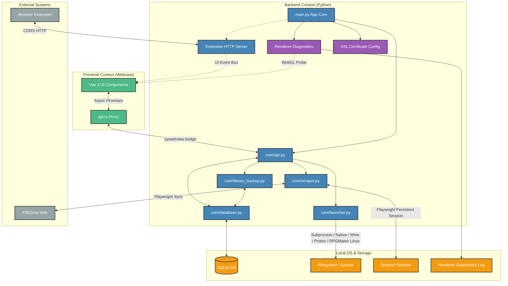

# Architecture Overview

wLib uses the same Vue frontend, Python backend, and Qt WebEngine desktop shell on Linux and Windows. Host-specific paths and launcher capabilities are resolved in `core/host_platform.py`.

## High-Level System Diagram

```mermaid
flowchart TD
    %% Define Styles
    classDef frontend fill:#4dba87,stroke:#333,stroke-width:2px,color:#fff;
    classDef backend fill:#4584b6,stroke:#333,stroke-width:2px,color:#fff;
    classDef storage fill:#f39c12,stroke:#333,stroke-width:2px,color:#fff;
    classDef external fill:#95a5a6,stroke:#333,stroke-width:2px,color:#fff;
    classDef diagnostics fill:#9b59b6,stroke:#333,stroke-width:2px,color:#fff;

    %% Components
    subgraph "Frontend Context (Webview)"
        UI[Vue 3 UI Components]:::frontend
        API_TS[api.ts Proxy]:::frontend
    end

    subgraph "Backend Context (Python)"
        MAIN[main.py App Core]:::backend
        API_PY[core/api.py]:::backend
        DB[core/database.py]:::backend
        BACKUP[core/library_backup.py]:::backend
        SCRAPER[core/scraper.py]:::backend
        LAUNCHER[core/launcher.py]:::backend
        EXT_SERVER[Extension HTTP Server]:::backend
        RENDERER[Renderer Diagnostics]:::diagnostics
        SSL[SSL Certificate Config]:::diagnostics
    end

    subgraph "Local OS & Storage"
        SQLITE[(SQLite DB)]:::storage
        FS[Filesystem / Games]:::storage
        BROWSER_SESSION[Browser Session]:::storage
        DIAG_LOG[Renderer Diagnostics Log]:::storage
    end

    subgraph "External Systems"
        F95[F95Zone Web]:::external
        EXT[Browser Extension]:::external
    end

    %% Flow
    UI <-->|Async Promises| API_TS
    API_TS <-->|pywebview bridge| API_PY
    
    API_PY <--> DB
    API_PY --> BACKUP
    BACKUP <--> DB
    API_PY --> SCRAPER
    API_PY --> LAUNCHER
    MAIN --> API_PY
    MAIN -.-> EXT_SERVER
    MAIN --> RENDERER
    MAIN --> SSL

    DB <--> SQLITE
    SCRAPER <-->|Playwright Persistent Session| BROWSER_SESSION
    SCRAPER <-->|Playwright Sync| F95
    LAUNCHER -->|Subprocess / Native / Wine / Proton / RPGMaker Linux| FS
    
    EXT <-->|CORS HTTP| EXT_SERVER
    EXT_SERVER -.->|UI Event Bus| UI
    
    RENDERER --> DIAG_LOG
    RENDERER -.->|WebGL Probe| UI
```

## Tech Stack Overview

- **Backend Environment**: Python 3
- **Desktop Window Manager**: PyWebView with Qt WebEngine on Linux and Windows (Windows releases bundle PyQt6)
- **Frontend Framework**: Vue 3 (Composition API) + TypeScript + Vite + TailwindCSS
- **Database**: SQLite3 (Local file-based database)
- **Web Automation**: Microsoft Playwright (Sync API for background scraping)
- **Packaging**: PyInstaller and release scripts for Linux AppImage/tar.gz/DEB/RPM/AUR plus Windows x64 portable ZIP and per-user MSI

## Platform Paths

`core/host_platform.py` owns the default locations used by the database, scraper, extension sync, and diagnostics:

| Resource | Linux default | Windows default |
|----------|---------------|-----------------|
| App data | `~/.local/share/wLib` | `%LOCALAPPDATA%\wLib` |
| Database | `~/.local/share/wLib/wlib.db` | `%LOCALAPPDATA%\wLib\wlib.db` |
| F95Zone browser session | `~/.local/share/wLib/browser_session/` | `%LOCALAPPDATA%\wLib\browser_session` |
| Browser extension copies | `~/.local/share/wLib/extension/` | `%LOCALAPPDATA%\wLib\extension` |
| PyWebView storage | `~/.local/share/wLib/webview/` | `%LOCALAPPDATA%\wLib\webview` |
| Cache root | `~/.cache` | `%LOCALAPPDATA%\wLib\cache` |
| Playwright browsers | `~/.cache/ms-playwright` | `%LOCALAPPDATA%\wLib\playwright` |
| Renderer diagnostics | `~/.local/share/wLib/renderer-diagnostics.log` | `%LOCALAPPDATA%\wLib\renderer-diagnostics.log` |

`WLIB_DATA_DIR` overrides the app-data root and `WLIB_CACHE_DIR` overrides the cache root. Linux also respects `XDG_DATA_HOME` and `XDG_CACHE_HOME`; an existing legacy `~/.local/share/wLib` library is retained when the configured XDG data directory does not yet exist. On Windows, a missing `LOCALAPPDATA` falls back to `~/AppData/Local/wLib`.

At startup, `WLIB_PLAYWRIGHT_BROWSERS_PATH` takes precedence over the saved `playwright_browsers_path` setting and the platform default. MSI and portable Windows builds share the same user-data location; extracting a portable ZIP does not move the library beside the executable.

## Platform Capabilities

`Api.get_platform_capabilities()` exposes host capabilities and paths through the typed frontend bridge. Windows offers Auto Detect for native `.exe`, `.bat`, `.cmd`, `.jar`, and HTML targets. Linux additionally offers Linux Native, Wine/Proton, and the optional RPGMaker Linux runner, plus runtime installers, Wayland options, and Cheat Engine injection.

The frontend hides unavailable actions, while backend guards reject unsupported runtime operations. Imported per-game Linux launch options remain stored on Windows; users select Auto Detect before launching. JSON import skips global path settings written for the other OS and reports them in the inspection warnings.

## Process Isolation & Communication

wLib operates across two distinct contexts that never directly share memory:

1. **Python Backend Process (`main.py`)**:
   - Manages the entire lifecycle of the application.
   - Configures SSL certificates and Qt runtime environment.
   - Bootstraps the local SQLite database.
   - Ensures Microsoft Playwright's Chromium binaries are available on the user's system.
   - Starts the `http.server` daemon thread for the browser extension.
   - Instantiates the `pywebview` window and maps a Python class object (`Api`) to the JavaScript runtime.
   - Logs Qt and browser renderer diagnostics on both platforms; Linux release launchers handle GPU detection and the crash guard.

2. **TypeScript UI Context (Vue / Vite)**:
   - Runs purely inside the WebView constraint and lacks direct Node.js or native filesystem access.
   - Interacts with Python backend purely through async calls routed strictly via `window.pywebview.api`.
   - Python can also spontaneously send data to the frontend by executing JavaScript snippets inside the webview using `webview.evaluate_js()`. This is how background events like "Playtime Updated" or "Extension Add Request" are propagated into Vue's reactivity system.

## The `DEV_MODE=1` Loop

When executing in development mode (`DEV_MODE=1`), the Python backend skips loading the static built Vue files `ui/dist/`. Instead, it forcefully navigates the Webview frame to `http://localhost:5173`, allowing Vite's Hot Module Replacement (HMR) to work perfectly alongside the native Python app.

PowerShell sets this with `$env:DEV_MODE = "1"`. The current desktop bootstrap invokes `npm` directly, which can fail on Windows installations that expose only `npm.cmd`; see [Running the App Locally](../CONTRIBUTING.md#running-the-app-locally) for the browser-only development and desktop build/run paths.

## Renderer Diagnostics System

wLib logs Qt backend selection and WebGL renderer details on both platforms. Windows uses Qt's native platform selection and writes to `%LOCALAPPDATA%\wLib\renderer-diagnostics.log`. Linux release launchers add the following GPU compatibility behavior:

- **GPU Detection**: Probes GPU capabilities using `glxinfo`, `/sys/class/drm/`, and environment variables to determine hardware acceleration availability
- **Crash Guard**: Maintains `~/.local/share/wLib/.gpu_crash_guard` to automatically fall back to software rendering after a GPU crash
- **Diagnostic Logging**: Logs Qt backend selection, GPU detection reason, renderer details, and WebGL probe results to `~/.local/share/wLib/renderer-diagnostics.log`
- **Browser Renderer Probe**: Executes WebGL detector scripts in the PyWebView to capture the browser's GPU renderer information
- **AppImage Integration**: The AppRun script performs parallel GPU detection and logs launch context to `~/.local/share/wLib/appimage-launch.log`

This system ensures wLib works reliably across diverse Linux configurations with varying GPU drivers and display servers.
